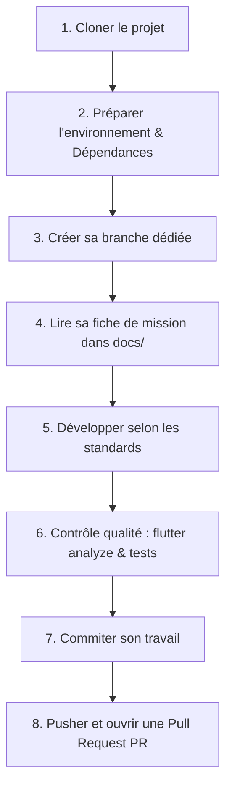

# 🚀 Guide de Démarrage et Workflow Développeur (CheckMe)

Bienvenue dans l'équipe de développement de **SaveBabe** !  
Ce guide récapitule la méthodologie de travail, le workflow Git et la checklist obligatoire à respecter pour chaque collaborateur.

---

## 🗺️ Workflow Global de l'Équipe



---

## 📌 Les Étapes Pas à Pas

### Étape 1 : Cloner le dépôt Git
Récupérez le projet sur votre machine locale :
```bash
git clone <URL_DU_DEPOT_GIT>
cd save_babe_app
```

---

### Étape 2 : Préparer l'environnement et tester le projet
Assurez-vous que Flutter est opérationnel et téléchargez les dépendances :
```bash
flutter doctor
flutter pub get
```
Lancez l'application une première fois sur émulateur ou appareil physique pour vérifier que tout fonctionne :
```bash
flutter run
```

---

### Étape 3 : Créer sa branche de travail
> ⚠️ **RÈGLE IMPORTANTE** : Ne **JAMAIS** développer directement sur la branche `main`.  
> Chaque responsable crée sa propre branche à partir de `main` à jour :

```bash
git checkout main
git pull origin main
```

Puis créez votre branche selon votre rôle :

| Rôle | Commande Git de création de branche |
|---|---|
| 🔔 **Responsable Notifications** | `git checkout -b feature/notifications` |
| 🔐 **Responsable Sécurité** | `git checkout -b feature/securite-chiffrement` |
| 🤖 **Responsable Intégration IA** | `git checkout -b feature/integration-ia` |
| 📚 **Responsable Structuration & Doc** | `git checkout -b chore/documentation-architecture` |
| 🤰 **Responsable Suivi de Grossesse** | `git checkout -b feature/suivi-grossesse` |

---

### Étape 4 : Consulter sa fiche de mission détaillée
Avant d'écrire la moindre ligne de code, ouvrez votre document dédié dans le dossier `docs/` :

- 🔔 [docs/Responsable_Notifications.md](docs/Responsable_Notifications.md)
- 🔐 [docs/Responsable_Securite.md](docs/Responsable_Securite.md)
- 🤖 [docs/Responsable_Integration_IA.md](docs/Responsable_Integration_IA.md)
- 📚 [docs/Responsable_Structuration_Documentation.md](docs/Responsable_Structuration_Documentation.md)
- 🤰 [docs/Responsable_Suivi_Grossesse.md](docs/Responsable_Suivi_Grossesse.md)

Ces fiches listent précisément :
- Les fichiers existants à comprendre
- Les nouveaux fichiers et packages à ajouter
- Les étapes d'implémentation
- Les critères de validation de votre tâche

---

### Étape 5 : Développer en respectant les standards
- **Architecture** : Respecter la séparation `core/` (services partagés, thème, état) et `features/` (modules métier).
- **Offline-First** : Toute fonctionnalité doit pouvoir fonctionner sans connexion Internet via Hive.
- **Confidentialité** : Aucune donnée médicale ne doit être affichée dans des logs (`print`) ou envoyée en clair.
- **Règles Flutter récentes** :
  - Utiliser `.withValues(alpha: X)` au lieu de `.withOpacity(X)` (déprécié).
  - Privilégier les constructeurs `const` partout où c'est possible.

---

### Étape 6 : Contrôle Qualité Obligatoire (Zéro Warning)
Avant chaque commit, vous devez obligatoirement exécuter les 3 commandes de contrôle qualité :

```bash
# 1. Analyse statique (doit afficher : No issues found!)
flutter analyze

# 2. Formatage automatique du code
dart format .

# 3. Lancement des tests unitaires
flutter test
```

---

### Étape 7 : Sauvegarder son travail (Commits conventionnels)
Effectuez des commits atomiques avec des messages clairs suivant la convention *Conventional Commits* :

```bash
git add .
git commit -m "feat(scope): description claire de la fonctionnalité"
```

*Exemples de préfixes :*
- `feat(notifications): ajout du service de planification quotidienne`
- `fix(securite): chiffrement de la boite userStateBox`
- `docs(readme): ajout du guide d installation rapide`
- `refactor(ia): migration vers le nouveau client Gemini`

---

### Étape 8 : Pusher et ouvrir une Pull Request (PR)
Poussez votre branche sur le serveur distant :
```bash
git push -u origin <nom-de-votre-branche>
```

Sur GitHub ou GitLab :
1. Cliquez sur **Compare & pull request**.
2. Base de fusion : `main` (ou `develop` selon la convention d'équipe).
3. Remplissez le modèle de description de PR en cochant les critères validés.
4. Demandez une revue de code à vos collègues.
5. Après validation par l'équipe, fusionnez (*merge*) la PR !

---

## ✅ Checklist Finale du Développeur (Avant soumission de PR)

- [ ] Ma branche part bien de `main` à jour.
- [ ] J'ai lu et appliqué les consignes de ma fiche de mission dans `docs/`.
- [ ] La commande `flutter analyze` retourne **0 erreur et 0 warning**.
- [ ] Le code a été formaté avec `dart format .`.
- [ ] L'application compile et tourne sans crash (`flutter run`).
- [ ] Aucun secret, clé d'API ou donnée personnelle n'est hardcodée dans le code source.
- [ ] Mes messages de commits sont explicites.
